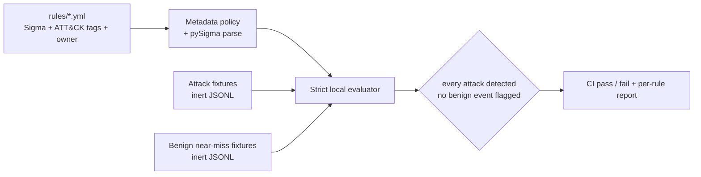
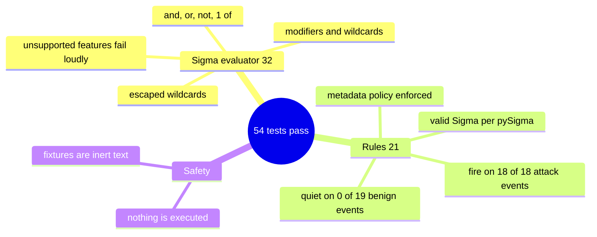

# detection-as-code

[](https://github.com/EquinoxWN/detection-as-code/actions/workflows/ci.yml)


> Treats security alerts like software: detections written in Sigma, tested against real attack logs, deployed through CI.

Part of my **Cyber Security** list · Python · YAML · core project

## Architecture

**What M1 runs today:**



**Full roadmap (M1 to M3):**


## How it works

_Steps 1 and 2 are built and tested (M1); the rest is on the [roadmap](#roadmap)._

1. Each detection is a Sigma rule tagged with ATT&CK techniques, a severity and an owner.
2. Every rule (including those from identity-attack-lab) has attack logs that should trigger it (from Atomic Red Team runs or OTRF datasets) and benign logs that should not.
3. CI loads the logs into Elastic in Docker, converts rules with pySigma, and asserts each rule fires on attacks and stays quiet on benign data.
4. Rules that pass deploy automatically to the SIEM.
5. An ATT&CK Navigator layer shows coverage and gaps.
6. False-positive rates are tracked and exceptions are reviewed on a schedule.

## Tech stack

| Area | Tools |
|---|---|
| Rules | Sigma, pySigma backends for Splunk and Elastic |
| Data | Atomic Red Team simulations, OTRF Security Datasets |
| CI/Map | GitHub Actions with Elastic in Docker, MITRE ATT&CK Navigator |

Language: **Python · YAML**. Nothing here runs an attack: rules are YAML and the test logs are inert JSON text.

| Path | What it is |
|---|---|
| `rules/windows/process_creation/*.yml` | Sigma rules with ATT&CK tags, `level` and `owner` |
| `tests/fixtures/<rule>/attack.jsonl` | Events the rule must detect |
| `tests/fixtures/<rule>/benign.jsonl` | Near-miss events the rule must ignore |
| `src/detection_as_code/sigma.py` | Strict Sigma evaluator used to replay the fixtures |
| `src/detection_as_code/rules.py` | Rule loading and metadata policy (UUID, level, owner, ATT&CK tags) |
| `src/detection_as_code/cli.py` | `make report`: per-rule results table |

## Run it

Needs Python 3.11 or newer.

```bash
make setup   # install PyYAML, pytest, ruff and pySigma
make test    # evaluator tests + every rule against its attack and benign logs
make report  # per-rule table: attack events caught, benign events flagged
```

Add a rule:

1. Write `rules/<category>/<name>.yml` with `id` (UUID), `level`, `owner` and ATT&CK tags.
2. Add `tests/fixtures/<name>/attack.jsonl` and `benign.jsonl`, one JSON event per line.
3. Run `make test report`; CI blocks the merge if the rule misses an attack or flags a benign event.

## Tests and results

Latest local run (full detail in [docs/results/m1.md](docs/results/m1.md)):

| Rule | ATT&CK | Level | Attack events detected | Benign events flagged |
|---|---|---|---|---|
| Certutil Used to Download a File | T1105 | high | 3/3 | 0/3 |
| LSASS Memory Dump via comsvcs.dll MiniDump | T1003.001 | critical | 2/2 | 0/3 |
| PowerShell Launched With an Encoded Command | T1059.001, T1027 | high | 4/4 | 0/4 |
| Scheduled Task Created to Run From a User-Writable Folder | T1053.005 | medium | 3/3 | 0/3 |
| Volume Shadow Copies Deleted | T1490 | high | 3/3 | 0/3 |
| Web Server Process Spawning a Shell | T1505.003, T1033 | high | 3/3 | 0/3 |

| Check | Result |
|---|---|
| Test suite | 54 passed, 0 failed |
| Rules valid according to the official pySigma parser | 6/6 |
| Attack events detected | 18/18 |
| Benign near misses flagged | 0/19 |

The fixtures are hand-written events reproducing the referenced Atomic Red Team command lines; recorded datasets and the Elastic-in-Docker check arrive in M2.

### Test map



## Roadmap

**M1** (≈15 h)
- [x] Write `docs/rfc/0001-design.md`: problem, goals, non-goals, chosen design
- [x] Each detection is a Sigma rule tagged with ATT&CK techniques, a severity and an owner.
- [x] Every rule (including those from identity-attack-lab) has attack logs that should trigger it (from Atomic Red Team runs or OTRF datasets) and benign logs that should not.

**M2** (≈20 h)
- [ ] CI loads the logs into Elastic in Docker, converts rules with pySigma, and asserts each rule fires on attacks and stays quiet on benign data.
- [ ] Rules that pass deploy automatically to the SIEM.

**M3** (≈25 h)
- [ ] An ATT&CK Navigator layer shows coverage and gaps.
- [ ] False-positive rates are tracked and exceptions are reviewed on a schedule.
- [ ] Publish the proof below with real numbers

## Proof

What this repo must show before it counts as done:

- The ATT&CK coverage heatmap and per-rule CI test results.

| Result | Value |
|---|---|
| M3 proof above | Not measured yet (M3). Current M1 numbers: see [Tests and results](#tests-and-results). |

## Why it matters

- **Interview angle:** 'Build a detection program for a SOC'.
- **Upstream I'm contributing to:** SigmaHQ rules repository.

## Design docs

- [RFC 0001: design](docs/rfc/0001-design.md)
- [ADR 0001: record architecture decisions](docs/adr/0001-record-architecture-decisions.md)
- [ADR 0002: test rules with a local evaluator first, a real SIEM second](docs/adr/0002-local-evaluator-before-siem.md)

## Scope

This is a learning and portfolio system, not a hosted production service. Everything runs locally.

## Security and contributing

- Every GitHub Action is pinned to a commit SHA; workflows run read-only, without persisted credentials.
- Dependabot proposes dependency and action updates weekly.
- `ruff` with security (bandit) rules and `ruff format --check` on every push; `pip-audit` (`make audit`) in CI.
- Report vulnerabilities privately: see [SECURITY.md](SECURITY.md). To contribute, see [CONTRIBUTING.md](CONTRIBUTING.md).

## License

MIT, see [LICENSE](LICENSE).
