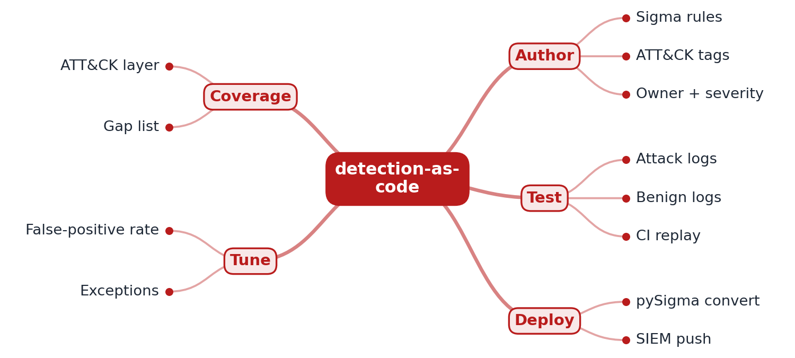

# RFC 0001: detection-as-code design

- **Status:** Accepted (M1 implemented)
- **Author:** AUTHOR_NAME
- **Created:** 2026

## Problem

Security teams often write detections straight into a SIEM console. Nobody reviews them, nobody
knows whether they still fire after a log format changes, and false positives pile up until
analysts ignore the alert. Detections should be treated like software: version-controlled,
reviewed, tested against known-bad and known-good data, and deployed by CI.

## Goals

- Each detection is a Sigma rule tagged with ATT&CK techniques and tactics, a severity (`level`)
  and an accountable `owner` (M1).
- Each rule ships with attack logs it must fire on and benign logs it must ignore (M1).
- CI fails if any rule misses an attack event, flags a benign one, or is not valid Sigma (M1).
- Later: rules converted with pySigma and tested inside Elastic in Docker, then auto-deployed (M2);
  an ATT&CK Navigator coverage layer and false-positive tracking (M3).

## Non-goals

- Running attacks. This repository only holds rules and log text; no attack tooling is executed.
- A production SIEM. Deployment targets a local Elastic stack.
- Running as a hosted production service.

## Proposed design



```
rules/**/*.yml ──► metadata checks (id, level, owner, ATT&CK tags)
      │         └► pySigma parse (official validity)
      ▼
compile_detection() ──► replay tests/fixtures/<rule>/attack.jsonl  (must all match)
                     └► replay tests/fixtures/<rule>/benign.jsonl  (must never match)
                               │
                               ▼
                 make report: per-rule table, exit 1 on any failure
```

- **Rule format:** standard Sigma plus one extra top-level field, `owner`, the team paged for
  the alert. pySigma keeps unknown fields as custom attributes, so the rules stay portable.
- **Metadata policy** (`rules.py`): a UUID `id`, a `level` from the Sigma scale, at least one
  technique tag (`attack.tNNNN[.NNN]`), at least one tactic tag, a non-empty owner, a condition,
  and documented false positives. Duplicate ids fail the build.
- **Evaluator** (`sigma.py`): see ADR 0002. It covers the subset of Sigma the rules use and
  rejects everything else.
- **Fixtures:** one JSON event per line in Sysmon Event ID 1 shape (`Image`, `OriginalFileName`,
  `CommandLine`, `ParentImage`, `User`). Benign files contain deliberate near misses.

### M1 rule set

| Rule | Technique | Why it is in the first set |
|---|---|---|
| Encoded PowerShell | T1059.001, T1027 | The most common execution trick in real intrusions |
| Certutil download | T1105 | Classic "living off the land" payload fetch |
| comsvcs MiniDump of LSASS | T1003.001 | Credential theft with no extra tooling |
| Shadow copy deletion | T1490 | A strong ransomware precursor |
| Scheduled task from a user-writable path | T1053.005 | Common persistence |
| Web server spawning a shell | T1505.003, T1033 | Web-shell footprint |

## Alternatives considered

| Option | Why not (yet) |
|---|---|
| Write queries directly in KQL or SPL | Locks rules to one vendor; Sigma converts to many backends. |
| Only run tests inside Elastic | Slow and Docker-dependent for every edit; kept for M2 as the second, authoritative layer (ADR 0002). |
| Use full vendor datasets now | Large downloads and licence review needed; small curated fixtures keep M1 reviewable in a pull request. |
| Store severity or owner in a separate spreadsheet | Drifts from the rule; keeping them in the rule file makes review atomic. |

## Measurement plan

- M1: per-rule attack detection and benign false positives (`make report`), all in CI.
- M2: the same results from Elastic in Docker, and the agreement rate with the local evaluator.
- M3: ATT&CK Navigator coverage layer and false-positive rate on benign telemetry over time.

## Milestones

- **M1 (done):** rules with metadata policy, labelled logs, evaluator, pySigma validation, report.
- **M2:** Elastic in Docker in CI, pySigma conversion, deploy on merge.
- **M3:** coverage heatmap, false-positive tracking, scheduled exception review.

## Risks and open questions

- Hand-written fixtures can share the author's blind spots. Recorded datasets (M2) reduce that.
- Command-line rules are easy to evade by renaming binaries. Where possible, rules also match
  `OriginalFileName`; the PowerShell rule's fixtures include a renamed binary.
